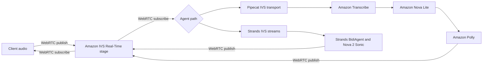

# Amazon IVS real-time voice sample

> [!WARNING]
> This sample is validated for the scope documented below. It is not production-ready and
> has no availability, latency, scale, security, or support guarantees.

This sample uses Amazon IVS Real-Time as the WebRTC media path between a
client and a server-side voice agent. It demonstrates two separate agent paths:

1. **Pipecat:** Amazon Transcribe, Amazon Nova Lite, and Amazon Polly in a
   cascaded speech-to-text, language model, and text-to-speech pipeline.
2. **Strands:** Strands `BidiAgent` with Amazon Nova 2 Sonic as a
   speech-to-speech model.

You can also combine the frameworks. For example, Pipecat can own media and
conversation flow while a Strands agent handles a tool-heavy reasoning step.
That combined design was not validated. The sample does not create or delete AWS
resources.

## Architecture



The shared harness implements the IVS-specific media boundary:

- WHIP publishing and WHEP subscription
- participant-token loading
- H.264 blank-video tracks required by IVS publisher offers
- aiortc SDP candidate repair
- bounded PCM output and received-audio measurement

## What the sample proves

The live checks used existing IVS stages and participants on 6 October 2026.
The observer counted a frame as non-silent when its root mean square (RMS)
amplitude exceeded `100`.

| Check | Exact path | Result |
|---|---|---|
| Direct IVS loopback | 440 Hz publisher → IVS → subscriber | **100/100 non-silent frames** |
| Pipecat end-to-end | PCM prompt → IVS → Transcribe → Nova Lite → Polly → IVS | **86/900 non-silent frames** |
| Strands end-to-end | PCM prompt → IVS → Nova 2 Sonic → IVS | **260/750 non-silent frames** |
| Shared local tests | Audio track and signalling safety | **12 passed** |
| Pipecat local tests | Conversion, buffering, pipeline order, cancellation, and interruption | **8 passed** |
| Strands local tests | Conversion, buffering, barge-in, lifecycle, H.264 offer, and SDP repair | **14 passed** |
| Validation contract self-check | Reference driver only | **15 passed, 2 opt-in tests skipped** |

The live counts prove only that non-silent audio returned through each selected
path. They do not measure audio continuity or compare the paths. The counts do
not establish transcription accuracy, response quality, end-to-end latency,
concurrency, load behaviour, or production reliability.

The validation self-check proves that the neutral test harness runs against its
reference driver. This repository does not contain Pipecat or Strands contract
drivers, so neither implementation has passed that contract. See
[`evidence/results.json`](evidence/results.json) for the machine-readable
record.

## Repository layout

- [`shared/`](shared/) contains the common live IVS harness.
- [`pipecat/`](pipecat/) contains the Pipecat transport and cascaded pipeline.
- [`strands/`](strands/) contains the Strands bidirectional stream adapters.
- [`validation/`](validation/) contains the provider-neutral adapter contract.
- [`evidence/`](evidence/) records the completed checks and their limits.

Each environment ships its own committed `uv.lock`. Keep the Pipecat and
Strands environments separate because their dependency sets were validated
independently and were not tested together.

## Run the local checks

Run these commands from the repository root. Install
[uv](https://docs.astral.sh/uv/) first.

1. Sync the Pipecat environment.

   ```console
   uv --directory amazon-ivs-realtime-voice/pipecat sync --python 3.13
   ```

2. Run the Pipecat offline self-check.

   ```console
   uv --directory amazon-ivs-realtime-voice/pipecat run python -m amazon_ivs_pipecat
   ```

3. Run the twelve shared tests.

   ```console
   uv --directory amazon-ivs-realtime-voice/pipecat run python -m pytest ../shared/test_audio_track.py
   ```

4. Run the eight Pipecat tests.

   ```console
   uv --directory amazon-ivs-realtime-voice/pipecat run python -m pytest tests
   ```

5. Sync the Strands environment.

   ```console
   uv --directory amazon-ivs-realtime-voice/strands sync --python 3.12
   ```

6. Run the fourteen Strands tests.

   ```console
   uv --directory amazon-ivs-realtime-voice/strands run python -m unittest discover -s tests -v
   ```

7. Run the validation contract against its reference driver.

   ```console
   uv --directory amazon-ivs-realtime-voice/validation run --no-project --python 3.12 --with-requirements requirements-test.txt python -m pytest --adapter-factory tests/reference_adapter.py:create_driver
   ```

The final command should report 15 passed and 2 skipped. The skipped checks are
the opt-in provider handshake and live IVS marker tests.

## Run the live checks

Live checks use AWS services and may incur charges. Run them only in a test
account against pre-existing IVS stages and participants. Do not use production
stages, credentials, audio, or customer data.

Before running these commands:

1. Complete the Pipecat and Strands environment sync steps above.
2. Configure AWS credentials and permissions for the services used by the
   selected path.
3. Store token and prompt files outside the repository.
4. Put the complete `participantToken` response object in each token file,
   including `token` and `participantId`.
5. Encode the prompt as signed 16-bit, little-endian, 16 kHz mono PCM.

Replace each `path/to/...` value before running a command.

1. Run the direct IVS loopback with separate publisher and subscriber
   participants.

   ```console
   uv --directory amazon-ivs-realtime-voice/pipecat run python ../shared/ivs_loopback.py --publisher-token-file "path/to/publisher-token.json" --subscriber-token-file "path/to/subscriber-token.json" --frames 100
   ```

2. Run the Pipecat path with separate source, agent, and sink participants.

   ```console
   uv --directory amazon-ivs-realtime-voice/pipecat run python ../shared/live_pipecat_e2e.py --source-token-file "path/to/source-token.json" --agent-token-file "path/to/agent-token.json" --sink-token-file "path/to/sink-token.json" --prompt-pcm "path/to/prompt.pcm" --region us-east-1 --model-id amazon.nova-lite-v1:0 --voice Joanna --frames 900
   ```

3. Run the Strands path with separate source, agent, and sink participants.

   ```console
   uv --directory amazon-ivs-realtime-voice/strands run python ../shared/live_strands_e2e.py --source-token-file "path/to/source-token.json" --agent-token-file "path/to/agent-token.json" --sink-token-file "path/to/sink-token.json" --prompt-pcm "path/to/prompt.pcm" --region us-east-1 --model-id amazon.nova-2-sonic-v1:0 --voice tiffany --frames 750
   ```

## Security and cleanup

- Redirects carrying participant tokens are limited to HTTPS subdomains of
  `live-video.net` on the default HTTPS port or explicit port `443`.
- Invalid and nonstandard ports are rejected before a token is forwarded.
- Runners log transcript roles and character counts, not transcript text.
- Live credentials are read from files or a silently populated environment
  variable. They are not embedded in source.
- Token JSON files ending in `-token.json` are ignored, but store them outside
  the repository and remove them after testing.
- Strands log-level changes apply only to the application logger. Dependency
  loggers remain at `WARNING`.
- Peer connections, tracks, workers, and model streams close in `finally`
  blocks.
- The live runners use existing participants. They do not create or delete AWS
  resources.

After a live run, remove temporary token, prompt, and environment files. Retire
test resources through their owning workflow.

## Known constraints

- IVS WHIP requires H.264 video in the publisher offer, so each audio publisher
  also sends a blank `yuv420p` video track.
- aiortc needs the IVS candidate-copy workaround before applying the remote SDP
  answer.
- Each process handles one subscribed participant.
- The sample does not implement acoustic echo cancellation. Use headphones for
  live testing.
- The sample has no deployment, authentication service, token rotation,
  monitoring, retry policy, load test, or operational runbook.
- The validated Pipecat path used Amazon Transcribe, Amazon Nova Lite, and
  Amazon Polly. The Strands path used Amazon Nova 2 Sonic. Cartesia and
  third-party speech models hosted on Amazon SageMaker were not tested.
